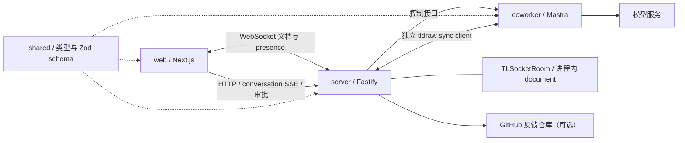

# drawless 开源准备分析

> 本文保留整改前的分析基线。后续修复与验证见 [2026-09-22 整改记录](./docs/open-source-remediation.md)。

分析日期：2026-09-21。代码基线：`1d4cd68`。本轮只分析与验证，不修改业务实现。

## 结论与发布目标

项目已经具备可复用的协同架构和基本测试基础，但尚未达到可以让外部贡献者放心安装、部署和修改的状态。主要缺口集中在房间隔离、Drew 写入正确性、默认质量门禁、授权说明和可复现部署，优先级高于视觉、性能微调或功能扩展。

建议第一阶段目标为 **可本地运行、功能边界明确的开源 Alpha**，另设“可公开部署”验收标准。开源 Alpha 不必同时完成账号体系、多租户、对象存储和多实例调度，但必须修复房间串用、越权和错误成功反馈，并明确临时数据的生命周期。

当前 AGENTS.md 仍要求不新增 AI 行为和 UI 优化。本报告检查已经存在的 AI 实现；后续修复应围绕现有能力的隔离、可靠性和可维护性展开。

## 1. 当前架构与值得保留的部分

仓库有 161 个已跟踪文件，TypeScript、TSX 和 CSS 合计约 22,910 行，包含 3 个应用和 2 个共享包。



应保留的设计：

- tldraw document 是画布事实源；上下文语义图由 TLStore 派生，没有必要重建第二套画布模型。
- Drew 使用独立协作者客户端加入房间，没有直接操作浏览器 editor。
- shared 已集中大部分跨端类型与运行时校验；编辑计划限制为最多 20 个操作，并校验操作 ID 和引用顺序。
- server 已把公开 approvalId 与 Mastra 的 runId/toolCallId 分离，具备审批占用、防重复提交、期限和审计事件。
- 前端已有切房隔离、请求 token、取消等待和待审批恢复逻辑。
- 反馈功能已有请求校验、正文限长、公开 Issue 提示、基础限流与幂等处理。

优化应补齐这些边界，不建议推翻当前 monorepo 或重写协同协议。

## 2. 实际验证结果

| 检查 | 结果 | 实际覆盖范围 |
| --- | --- | --- |
| shared 单测 | 10 / 10 通过 | 主要验证契约与 schema |
| server 单测 | 23 / 23 通过 | 配置、房间注册、HTTP 代理、审批和反馈等 |
| web 单测 | 79 / 79 通过 | 纯逻辑、状态转换、SSR 组件输出等 |
| shared / ui / server / web 类型检查 | 通过 | 默认检查包含的包 |
| shared / server / web 构建 | 通过 | Next.js 锁定版本为 15.5.19 |
| server 基础 smoke | 通过 | HTTP 健康检查、两个 WebSocket 共用一个房间 |
| coworker 类型检查 | **失败，8 个错误** | 默认根脚本未检查这一应用 |
| coworker Mastra build | 通过 | 构建通过不等于 TypeScript 检查通过 |
| coworker 控制面 smoke | 通过 | 真实 runtime 的 start → online → stop；内存存储、未调用模型 |
| npm 依赖审计 | **存在告警** | metadata：critical 4、high 35、moderate 36、low 2；69 条 advisory 记录 |
| 本地 Git 历史启发式扫描 | 未匹配到已配置的常见凭据模式 | 34 个本地可见提交、511 个唯一 blob；非完整秘密扫描认证 |

`pnpm check` 首次在沙箱禁止监听本机端口时中断；随后放行本机 smoke，并独立完成剩余 web 检查。不能把首次环境错误当作项目错误，也不能把补跑结果描述成 coworker 全部检查通过。

本轮没有调用线上部署、真实模型推理或真实 GitHub Issue 创建；权限验证使用本地服务和 mock。未做完整浏览器端到端测试、长时间负载测试、干净容器安装及线上基础设施配置审计。

coworker 类型错误分布：

- `apps/coworker/src/mastra/index.ts:83`：exporters 被推断为 MastraStorageExporter 数组，不能追加 MastraPlatformExporter。
- `apps/coworker/src/mastra/tools/canvas-edit-executor.ts:343` 等 7 处：样式映射推断为普通 string，不能赋给 tldraw 的颜色 / fill 字面量类型。

## 3. P0：正式发布或公开部署前优先关闭

### OSS-01：首页生产构建复用固定房间

**状态：已通过实际生产构建确认。影响：核心功能错误与房间隔离失效。**

位置：`apps/web/app/page.tsx:5`、`apps/web/src/lib/room-route.ts:21`。

首页在 render 中生成 UUID 后 redirect，但没有动态渲染边界。实际 `next build` 将 `/` 标记为静态页面，prerender manifest 的 `initialRevalidateSeconds` 为 false；首页 HTML、RSC 和 meta 都包含同一个固定的 `/rooms/room-…`。

因此“访问首页创建新房间”在生产构建中变成构建时创建一次房间，新访客会被引导到相同地址。只测试 `createRoomId()` 返回不同值无法覆盖这个错误。

处理：将创建房间放入明确按请求执行的动态入口，保留已有房间路由。验收：启动生产构建，两个独立新会话访问 `/` 得到不同 roomId；分享已有链接仍进入同一房间。

### OSS-02：server 没有房间授权，且公开枚举房间

**状态：本地 HTTP 注入验证确认。影响：公开部署后，房间可被发现、控制及审批。**

位置：`apps/server/src/http/app.ts:104`、`:127`、`:245`、`:272`，`apps/server/src/config.ts:118`，`apps/server/src/sync/tldraw-sync.ts:49`。

`/ready` 无需身份就返回全部活跃 roomIds。WebSocket 只验证格式和 Origin；sessionId 是调用方提供的字符串。coworker 的 start / stop / conversation / approval 接口没有房间成员或能力校验。HTTP hook 只决定是否附加 CORS 响应头，不拒绝不允许的 Origin。

本地复现：匿名 `/ready` 返回 200 和测试房间 ID；无 Origin 和不允许的 Origin 调用 stop 均返回 200，并执行 mock stop。

处理：先选定最小权限模型，例如带不可枚举凭据的房间分享能力，区分读、写、调用 AI 与审批权限；所有入口统一验证。`/ready` 仅保留聚合状态，房间明细放入受保护诊断接口。Origin 校验保留为浏览器侧防线，不能替代身份授权。无需因此立即引入完整账号体系。

验收：匿名用户不能枚举或操作私有房间；房间 A 的凭据不能读写或批准房间 B；非浏览器客户端也必须提供有效凭据。

### OSS-03：runtime 控制面直接暴露，房间上下文没有绑定到工具执行

**状态：源码确认；跨房间读取及审批转发使用 mock agent 复现。影响：跨房间访问、绕过公开控制面、未受限的服务端出站连接。**

位置：`apps/coworker/src/mastra/routes/coworker-room-routes.ts:30`，`collaboration/coworker-room-registry.ts:159`、`:239`、`:250`，`tools/canvas-context-tool.ts:36`，`packages/shared/src/coworker-control.ts:168`。

所有自定义 runtime 路由均设置 `requiresAuth: false`，部署说明还要求暴露公网域名。start 接受外部 `serverUrl`，只校验协议，能够驱动服务端对指定目标发起 WebSocket 连接，存在 SSRF / 出站访问风险。

`collect-canvas-context` 使用模型参数中的 roomId 查询全局 registry；当前会话房间只写进提示词和 memory 参数，没有在工具执行边界做强制绑定。mock 验证中，room A 对话的工具调用能读取已驻留的 room B。

runtime approve / decline 仅验证路径 roomId 的格式，没有核对 runId/toolCallId 所属房间。mock 验证中，用 room A 路径携带 room B 的 run/tool 标识，会被原样转交 agent。server 已有的审批映射校验不能保护被直接访问的 runtime。

处理：runtime 默认只在内部网络或本机提供服务，加入 server 到 runtime 的认证；服务端固定允许的 sync 地址；将可信 room / actor / run 上下文注入工具执行并校验归属，不能依赖模型正确填写 roomId。同步检查 Mastra 默认 API 是否存在其他可绕过的入口。

验收：伪造目标 URL、跨房间工具参数、跨房间 runId、绕过 server 的直接调用均被拒绝；正常读上下文和审批链路仍可用。

### OSS-04：断线后仍在线，画布未同步却返回成功

**状态：真实本地 WebSocket 断线测试复现。影响：用户收到虚假交付结果。**

位置：`apps/coworker/src/mastra/collaboration/coworker-room-client.ts:171`、`:232`、`:499`；`coworker-room-registry.ts:191`。

Node socket adapter 普通 close 只更新为 offline，没有定时重连策略；registry 也没有跟随连接状态变更。`waitUntilLoaded()` 是首次 hydration 的 Promise，不能代表后续重连完成。编辑结果以本地 store 修改为依据，没有验证服务器接收。

复现输出：

```text
before_disconnect: status=online, connections=1
after_disconnect:  status=online, connections=0
offline_edit:      applied=true, warnings=[], connections=0
```

处理：统一 transport、hydration 和 registry 状态，加入有上限及退避的重连；编辑前检查当前同步状态，建立写入确认 / 未确认结果语义。不能把本地 mutation 等同于协同交付成功。

验收：断线后状态及时变化；恢复后重新完成 hydration；离线执行不报成功；服务器和第二个客户端实际观察到写入后才算交付完成。

### OSS-05：动画式编辑覆盖并发修改

**状态：TLStore 级复现确认。影响：破坏协作正确性。**

位置：`apps/coworker/src/mastra/tools/canvas-edit-executor.ts:889`、`:933`、`:852`。

移动、缩放、逐字写文本会保留执行前的完整 shape，多次延迟后用旧对象 `store.put()`。同一 room 的 AI 编辑虽然串行，但人类协作者仍可同时修改；旧 shape 会把其他属性覆盖回去，删除也可能被后续帧重新写回。

复现：移动过程中注入用户对 shape meta 的修改，最终 `externalEditPreserved=false`。这是实际覆盖，不是单纯代码体积或动画性能问题。

处理：把视觉表现与 document 提交分离，优先一次性提交经过验证的业务变更；如必须多步提交，每步从最新 record 读取、仅改变授权字段，并检测目标删除或冲突。协作正确性不应依赖动画帧。

验收：AI 移动期间用户改文字、样式或 metadata 不被覆盖；删除目标后不会复活；冲突有明确结果。

### OSS-06：当前依赖树含严重安全公告

**状态：2026-09-21 实际运行 `pnpm audit --json`。影响：发布与部署的供应链基线。**

位置：`pnpm-lock.yaml`、各 workspace package.json。

审计 metadata 返回 77 项计数（4 critical / 35 high / 36 moderate / 2 low），advisories 对象包含 69 条记录。计数包含依赖路径等因素，不能描述为 77 个可利用的应用漏洞。

锁定的 Next.js 为 15.5.19，命中包括 AVIF 图片优化相关远程代码执行公告。该公告列出 15.5.24 为 15.x 修复版本；这是特定公告的修复下限，升级目标还应综合所有命中项。[Next.js 官方安全公告](https://github.com/vercel/next.js/security/advisories/GHSA-2xp9-vwfh-vxw4)

Vitest 2.1.9 也有 critical 告警，条件涉及暴露 Vitest UI server；当前脚本使用 `vitest run`，不能据此断言生产应用可被该问题攻击。其他命中涉及 Mastra 间接依赖、Hono、Vite、sharp、Tiptap 等。

处理：先区分生产可达路径、仅开发工具和未使用功能，再升级直接依赖及关联锁文件。为每个保留项记录适用条件和理由，避免盲目 overrides 破坏 tldraw / Mastra 兼容性；tldraw 家族包保持版本一致。

验收：生产可达的 critical / high 问题完成修复或具备具体有效的缓解证据，CI 运行持续审计，升级后同步与审批回归通过。

### OSS-07：开源许可证及 tldraw 授权配置不完整

**状态：仓库与官方文档确认。影响：正式开源授权不明确、他人部署不可复现。**

根目录没有 LICENSE；只有 coworker 的 scaffold 元数据写着 ISC，不能代替项目级授权说明。应用包使用 `private: true` 本身没有问题，开源应用不需要发布到 npm。

`apps/web/src/components/canvas-shell.tsx:26` 写死 tldraw licenseKey，解码载荷中的到期日期为 **2026-09-30**。tldraw 官方明确说明 license key 可以出现在前端，它不是模型 API secret；问题在于他人部署依赖维护者的特定授权及到期时间。[tldraw license key](https://tldraw.dev/sdk-features/license-key)

tldraw SDK 使用其专有许可，不能将 drawless 自有代码的开源许可扩大解释为 tldraw SDK 也获得同样授权；生产环境需要有效 key。[tldraw 许可说明](https://tldraw.dev/community/license)

处理：由维护者确定自有代码许可，补 LICENSE 和第三方许可说明；licenseKey 改为部署者配置，并说明本地开发与生产授权差异。复核设计参考图、字体及素材的可再分发范围。本轮不擅自选择或授予许可证。

验收：外部开发者能知道哪些代码可如何使用、哪些依赖另有许可，以及如何用自己的 key 部署。

## 4. P1：开源 Alpha 的工程与可靠性补齐

### OSS-08：coworker 被排除在默认质量门禁之外

位置：根 `package.json:7`、`:8`、`:17`、`:18`；`apps/coworker/package.json:7`。

根 build / check / test / typecheck 均没有完整覆盖 coworker。coworker 的 test 仍是默认失败占位命令，没有独立 typecheck 脚本，8 个真实类型错误因此未被默认门禁发现。仓库也没有 CI workflow。

处理：修复当前类型错误，统一所有包的 check 入口，加入无模型 API key 的核心测试与 CI；需外部模型的测试独立可选。Mastra build 与类型检查分别执行。

验收：任何 coworker 类型错误会让根检查和 CI 失败，干净 runner 无需维护者私有凭据即可完成默认检查。

### OSS-09：测试数量不能证明真实协同和审批完整可用

位置：`apps/server/src/scripts/smoke-sync-server.ts:32`、`smoke-coworker-control.ts:55`；各 `_spec`。

基础 sync smoke 只确认两个 WebSocket 能打开、registry 只有一个房间，没有发送真正的 shape 文档操作并验证另一端收到。coworker smoke 只验证生命周期，没有覆盖工具执行、审批与结果同步。web 组件主要是静态渲染及纯函数测试，无法发现生产首页静态化。

处理：围绕用户结果补少量关键集成测试，而非增加镜像实现的断言。

最低验收集合：生产首页新建隔离；双客户端增改删同步；断线重连；房间 A/B 隔离；审批拒绝零写入；重复批准不重复执行；批准后第二个客户端看到结果；刷新恢复待审批；AI 和人同时编辑；服务停止后的资源清理。

### OSS-10：临时房间的数据丢失条件说明不完整

位置：`apps/server/src/sync/room-registry.ts:121`、`:143`，README 的产品边界与存储说明。

不仅重启会丢数据：最后一个连接断开后约 30 分钟，room 会 close 并从 Map 删除，InMemorySyncStorage 随之不可再访问。Drew 的驻留客户端也会影响最后一个连接何时断开。

处理：Alpha 可保留内存模式，但必须明确“断开后过期”和导出 / 保存边界；如果对外承诺长期协作，就先实现单实例持久化及备份恢复。room 回收释放连接和内存，不应等同于删除已保存文档。继续保留单房间唯一服务者约束。

验收：文档准确描述丢失条件；持久模式下空闲回收、重启后重开仍可恢复；内存模式不能被误认为可靠存储。

### OSS-11：已批准计划缺少执行前条件与结果分级

位置：`packages/shared/src/canvas-edit.ts`，`canvas-edit-executor.ts:239`、`:982`、`:1134`。

审批可能等待较久，其间目标可被改动、删除或锁定。当前目标只检查是否为 shape，没有锁定策略；指定 page 不存在会静默选择其他 page。结果主要是 `applied: boolean`，只要存在部分 record ID 即算 applied，难以区分全部完成、部分完成和未确认同步。

处理：执行前验证 page、目标存在性、锁定策略和必要的版本 / 字段前提；明确部分失败策略。扩展 shared 结果契约表达每个 operation 的结果和同步状态，属性按约定写中文注释。必要时要求重新审批。

验收：审批后删除 page 不会把内容画到其他 page；锁定目标按明确规则处理；部分失败不显示为完整交付。

### OSS-12：取消、stop 和超时没有贯穿执行生命周期

位置：`apps/server/src/coworker/coworker-control-client.ts:160`，`apps/coworker/src/mastra/routes/coworker-room-routes.ts:209`，`coworker-room-client.ts:232`、`:263`，`use-coworker-conversation.ts:511`。

前端有 AbortController，但 runtime SSE 包装没有实现显式 cancel 清理；审批续流没有传递 abortSignal，cursor chat 也没有调用级取消。room close 没有取消 editQueue 中的任务。server 流式请求超时在拿到 Response 后清除，不能限制流的总时长。

另一个确定的代码缺陷：`runEdit()` 在 try 中 `return performCanvasEditToStore(input)`，没有 await，因此 finally 会在异步编辑完成前恢复 collaboration mode。当前 mode 也不能充当权限保证。

处理：区分“停止等待输出”与“停止执行”，建立按 room / run 管理的取消信号、执行时间上限、并发上限和关闭流程；把 finally 放在真正完成之后。明确已提交修改不可因断流自动撤销。

验收：stop 后不再继续本地编辑；不再有遗留模型调用与无限等待的流；重试不能重复创建对象。

### OSS-13：审批与会话恢复的生命周期不一致

位置：`coworker-approval-registry.ts:107`、`:227`；`apps/coworker/src/mastra/index.ts:43`；`use-coworker-conversation.ts:65`。

server 审批在内存中，30 分钟过期；coworker memory 默认写本地 mastra.db；前端 turns 仅为 React 状态，刷新只恢复 pending 审批，不恢复对话或交付。这与 README 中持续同事协作的承诺存在缺口。

runtime 接受批准请求后，server 就把审批标为 resolved；这表示“决定已接收”，不代表编辑完成。网络结果不确定时又可能回到 pending，缺少 runtime 级幂等与对账保证。

处理：定义会话可见历史、审批决策、执行结果各自的持久化与保留策略；绑定 room 生命周期或 generation，避免旧记忆和新空白文档混用。对于内存 Alpha，明确刷新 / 重启限制即可，不必先建设完整任务系统。

验收：刷新、server 重启、runtime 重启、超时后重试都有明确状态；不会把无法继续的旧计划展示成可执行审批。

### OSS-14：公开服务缺少容量和成本边界

位置：`room-registry.ts:39`，`coworker-room-registry.ts:58`、`:239`，`http/app.ts:102`，`cursor-chat-reply-handler.ts:67`。

房间 / 连接没有应用级总量限制，conversation 与 cursor chat 没有按调用者、房间或实例的预算限制，AI 编辑队列无上限。WebSocket 注册没有显式设置适合本项目的 payload 上限。基础 schema 限长不能替代请求速率、并发和整体内存预算。

处理：为 room 数、每房间连接数、消息大小、并发 run、模型调用和待执行编辑设置明确上限与拒绝行为；空闲回收不承担防滥用职责。限制需匹配内联资产策略，不能只降低 payload 而导致正常资源同步失败。

验收：达到上限时拒绝新增工作并返回可识别错误，已有房间继续正常同步。

### OSS-15：反馈限流可被不可信代理头绕过，缓存持续增长

位置：`http/app.ts:98`，`feedback-rate-limiter.ts:29`，`feedback-submission-registry.ts:28`。

`trustProxy: true` 无条件信任代理头。本地测试中，同一来源只改变 X-Forwarded-For，4 次请求均返回 201，绕过 3 次 / 10 分钟限制。实际公网可利用性取决于上游是否覆盖该头，当前仓库没有对拓扑作出约束。[Fastify trustProxy 文档](https://fastify.dev/docs/latest/Reference/Server/#trustproxy)

限流 Map 不删除不再访问的 key；幂等 registry 只在再次 get 同一个 key 时删除过期项，而 submissionId 通常唯一。两者缺少容量与全局过期清理。

处理：将可信代理范围做成部署配置，加入有限容量和主动 / 机会式全局清理，必要时增加服务级预算。保留现有公开反馈提示与安全正文处理。

验收：伪造代理头不能重置额度；大量不同 key 过期后内存条目下降；重试仍只创建一次 Issue。

### OSS-16：共享包边界被源码相对路径绕过

位置：`apps/coworker/package.json`，coworker 中 9 处 `../../../../../packages/shared/src/index` 导入。

coworker 实际依赖 shared，却没有声明 `@drawless/shared: workspace:*`。依赖关系隐藏在跨目录源码引用里，独立构建、依赖裁剪和工具调度难以正确识别。其 TypeScript 6 配置也未继承其他包使用的公共严格选项。

处理：统一从 shared 包公开 exports 导入，声明真实 workspace 依赖；评估 Mastra 的 bundling 配置和 ESM 解析后收敛 TS 配置。不要为了对齐版本而无验证地强升整个仓库。

验收：依赖图能表达 coworker → shared；移动内部源码文件不迫使所有应用改路径；单独构建 coworker 有明确前置步骤。

### OSS-17：可配置的 sync 路由在客户端失效

位置：`apps/server/src/config.ts:149`，`apps/web/src/lib/sync-config.ts:10`，`coworker-room-client.ts:609`。

server 支持 SYNC_ROUTE；web 固定使用 shared 的 `/sync`，coworker URI 也写死 `sync`。使用文档列出的自定义后端前缀时，两类客户端不能自动跟随。

处理：选择统一的协同端点契约并贯通配置，或删除没有完整支持的可配置项。同步处理 HTTP 地址只允许 http(s)、WebSocket 地址允许 ws(s) 的不同约束。

验收：自定义前缀、反向代理 path prefix、HTTPS / WSS 都有双端联通测试。

### OSS-18：新贡献者的启动与部署流程不可完整复现

位置：根 `package.json:15`，三个 `.env.example`，README、DEPLOYMENT、coworker README。

- 根目录没有 Node engines / 版本文件，只有 coworker 声明 Node >=22.13；不同包的 TypeScript / Node 类型版本不一致。
- 完整栈用 shell `&` 启动，没有统一错误传播、就绪等待和退出回收，也不跨平台。
- server 的 dev 实际 build 后运行，无 watch；server 未实现 .env 文件加载，需要明确通过外部环境注入。
- server 示例环境变量遗漏反馈开关与凭据配置；runtime 的 storage / observability / telemetry 配置缺少统一说明。
- coworker README 的验证段写 `pnpm build`，而根 build 并不构建 coworker，执行目录和命令容易混淆。
- DEPLOYMENT 混入维护者真实域名与默认个人反馈仓库；缺少可复用的容器 / 部署配置、卷挂载和重启说明。

处理：明确“基础画布”和“带 Drew”两条最小运行路径；统一 Node / pnpm 版本和 env 加载规则；提供一个管理子进程退出的启动命令。先完成单实例部署模板，再考虑多实例。

验收：新机器按 README 可完成安装、启动、退出、检查和生产构建；未配置模型 key 时基础协同仍可工作；部署者不需要修改源码或引用维护者个人服务。

## 5. P2：维护性和项目治理

### OSS-19：公共 SSE 协议仍与 Mastra 原始结构耦合

位置：`coworker-public-stream.ts:47`、`:175`，`coworker-conversation-output.ts`，`coworker-conversation-timeline.ts`。

server 通过复制原事件、删除顶层和 payload 中的部分 ID 来生成公开流；未知字段、嵌套标识和错误 stack 未形成严格白名单。非 JSON 块直接转发。web 仍需兼容多个 Mastra 字段形态，shared 没有完整的公开流事件联合类型。

处理：在 shared 定义带版本的公开事件协议，server 明确转换允许的文本、审批、结果、错误和结束事件；不把 debug 原始信息视为公共 API。验证最大事件大小、异常 JSON、UTF-8 分片和 reader 清理。

验收：升级 Mastra 时主要修改 adapter；未知 runtime 字段不自动发给浏览器；私有标识、路径和 stack 不进入公开流。

### OSS-20：模块职责过大，执行与表现混合

`canvas-edit-executor.ts` 1269 行同时承担记录构造、引用解析、样式、分帧执行、presence 和结果；`coworker-room-client.ts` 696 行混合传输适配、身份、presence、聊天观察和编辑队列；`use-coworker-conversation.ts` 595 行混合流读取、恢复、审批与 React 状态。

处理：先围绕 OSS-04 / 05 / 12 的正确性修复划分稳定边界：传输与恢复、纯编辑计划执行、presence 表达、conversation 生命周期。避免仅为缩短文件而机械拆分。2300 行 globals.css 可后续整理，但不作为本轮 UI 重做任务。

验收：核心逻辑可脱离浏览器 / 模型单测，领域状态有单一权威来源，组件不重复推导业务真相。

### OSS-21：数据流、日志与可选外部服务说明不足

位置：`coworker-room-registry.ts:118`，`apps/coworker/src/mastra/index.ts`，`drawless-coworker.ts:52`。

cursor chat 被直接打印到日志；会话 memory 默认写本地文件；模型固定为 DeepSeek；打开 observability 时还可能导出跟踪。用户需要知道画布上下文、消息、日志和公开反馈分别流向哪里、保留多久。

处理：文档说明数据流及默认策略，日志默认不记录原文，模型 / 存储 / 遥测配置明确。反馈已经有公开 GitHub Issue 提示，应保留。此项是补齐现有行为说明，不要求扩展新的 AI 产品能力。

验收：基础模式无需外部 AI 凭据；关闭相关开关后不发对应外部请求；用户能定位并清理本地持久数据。

### OSS-22：缺少贡献与发布治理

缺少 CONTRIBUTING、SECURITY、变更记录、Issue / PR 模板、CI、依赖更新配置、统一 lint / format。root 0.0.0 与 coworker 1.0.0 的版本含义也未说明。

处理：建立最小治理：支持的运行环境、贡献流程、检查命令、私下安全反馈渠道、版本与兼容策略。提交约定与代码格式自动化即可，不必同时引入复杂发布平台或强制 CLA。

验收：贡献者能完成第一个 PR，维护者能重复发布同一版本，安全问题有非公开报告渠道。

### OSS-23：当前文档与工程指令互相冲突

AGENTS.md 仍写“AI 功能不启用”“web 只承载 tldraw”，而 README、ARCHITECTURE、specs、.impeccable.md 和实际代码已经包含 Drew 及完整交互。某些“只负责 sync”注释也已过时。

处理：明确当前版本范围、哪些是已经实现、哪些是将来目标；由维护者统一 AGENTS 的有效约束。本轮不以 README 为理由越过用户给出的“不新增 AI / 不做 UI 优化”指令。

验收：开发者及 agent 从不同文档得出一致的架构和工作范围。

### OSS-24：仓库发布卫生需要最后清理

已跟踪多张中间审计截图与对照参考图；`design-qa.md:5` 等含维护者 `/Users/...` 绝对路径。根 gitignore 仅覆盖部分 env 文件名，没有通用 `.env.*` 加 example 例外的策略。

本轮本地历史启发式扫描没有发现匹配的常见 provider token、GitHub token、AWS key 或私钥头；这不覆盖远程未获取分支、不规则密钥、图片内容或全部高熵秘密。

处理：补正式秘密扫描与 CI；保留有价值的架构 / 最终验证材料，归档无用中间截图，确认素材来源；将本机绝对路径改为可移植说明。不因当前树删除了文件就假定历史中也已清理。

验收：公开仓库不依赖本机路径，env 示例可提交、真实配置默认忽略，素材和历史扫描有明确结果。

## 6. 建议处理顺序

| 批次 | 范围 | 完成标志 |
| --- | --- | --- |
| 1：消除核心错误 | OSS-01、04、05，给已复现问题补回归 | 新用户独立房间；断线不报成功；协作修改不被动画覆盖 |
| 2：统一可信边界 | OSS-02、03、14、15 | 房间权限、runtime 认证、工具上下文、成本与容量受控 |
| 3：建立检查基线 | OSS-06、08、09、16 | 依赖告警完成分类修复，coworker 纳入类型和行为检查，CI 可复现 |
| 4：确定生命周期 | OSS-10、11、12、13、17、19 | 临时 / 持久模式明确，审批、执行、取消、重连、协议可对账 |
| 5：形成开源发布包 | OSS-07、18、21、22、23、24 | 许可、README、部署模板、数据流和贡献入口完整 |
| 6：持续维护 | OSS-20 及有测量依据的性能优化 | 在回归保护下整理模块，保持文档与实现同步 |

许可选择应在开始整理发布包时确定；上述顺序不表示需要等待所有工程工作完成才讨论许可。持久化和部署部分应依赖最终发布定位确定范围。

## 7. 最小发布验收清单

- [ ] 自有代码 LICENSE、tldraw 授权边界和素材来源明确。
- [ ] 两次生产入口访问不会落入同一新房间，分享房间仍可协作。
- [ ] 所有公共入口遵守相同房间权限；runtime 默认不能被绕过访问。
- [ ] 工具读写及审批绑定可信 room / run，不能由模型参数扩大范围。
- [ ] 断线、冲突、部分失败不报告完整成功；停止后无遗留写入。
- [ ] shared、ui、server、web、coworker 都有合适的统一检查并在 CI 运行。
- [ ] 真实双客户端同步、审批执行及恢复有无模型费用的自动化回归。
- [ ] 生产可达的严重依赖告警已处理，其余有明确适用性判断。
- [ ] 干净环境按 README 能启动基础模式及可选 Drew 模式。
- [ ] 数据保留、内存房间过期、单实例限制和模型调用成本边界明确。
- [ ] 贡献、安全报告、版本发布和秘密扫描流程可用。

暂不列为首发必做：UI 美化、品牌重设计、更多 AI 工具、复杂账号 / 空间体系、多模型平台、插件系统、全量国际化、横向扩容、独立的第二套画布图结构。
