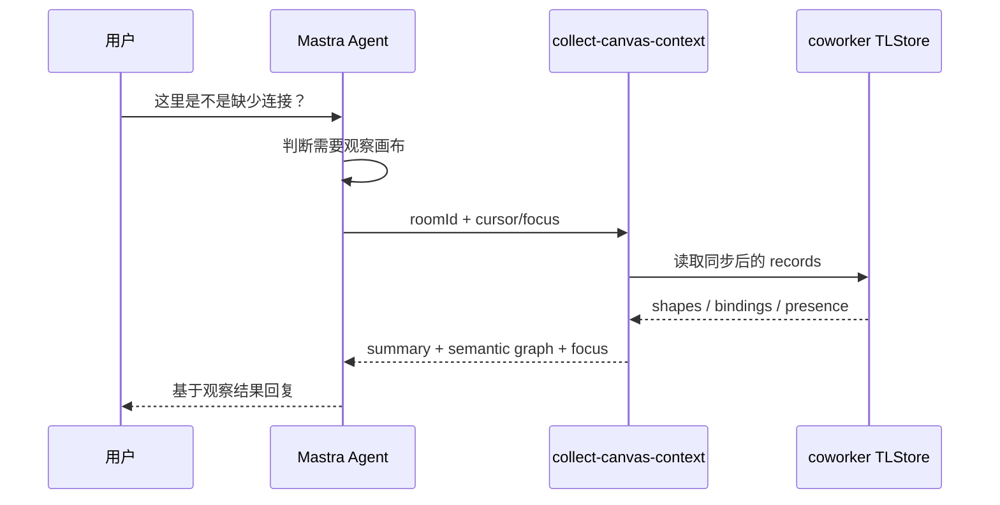

# Coworker 画布上下文收集工具方案

## 背景

当前 cursor chat 已经能触发 coworker 回复，但 AI 实际拿到的画布上下文只有 record、shape、presence 的数量统计。旧方案里还存在“工具代替 agent 拼回复”的倾向，不利于让 agent 按需观察画布并自行推理。

这会带来两个问题：

- AI 不能按需判断是否观察画布。
- 回复逻辑被工具接管，agent 反而不像 ReAct 中负责 reasoning 的主体。

新的方向是移除“回复型 tool”，改成一个只读的 `collect-canvas-context` 工具。agent 在判断用户问题需要理解画布时调用工具，工具从 coworker 已同步的 `TLStore` 派生观察结果，再交给 agent 自己组织回复。

## 调研结论

### tldraw 数据读取

tldraw 的协同事实源仍然是 sync room 内的 document。coworker 作为协作者加入 room 后，本地 `TLStore` 是这份 document 的同步镜像。

可稳定读取的数据层：

- `TLStore.allRecords()`：读取本地 store 里的全部 records。
- `shape` record：表达文本、便签、图形、箭头、frame、group 等画布对象。
- `binding` record：表达箭头端点等连接关系。
- `instance_presence` record：表达协作者 cursor、当前 page、选区和 cursor chat。

不建议直接把原始 records 交给模型。原始 records 字段多、形态复杂、容易浪费上下文，也会让模型误把底层协议细节当成业务语义。

### Mastra tool 使用

Mastra 的 agent 会根据用户消息、instructions、tool description 和 schema 决定是否调用工具。工具适合提供模型无法凭空可靠获得的外部数据，例如当前画布状态。

因此更合理的 ReAct 形态是：

## 上下文结构

工具返回四类信息：

1. `summary`
   - 画布总览。
   - shape 类型数量。
   - 文本预览。
   - 当前选区和最近变化。

2. `semanticGraph`
   - 节点：从 shape 派生，包含类型、文本、位置、父级和 page。
   - 边：从 arrow shape 和 binding records 派生。
   - 区域：从 frame/group 的 parentId 层级派生。

3. `focus`
   - 用户当前选区。
   - 当前消息显式关注对象。
   - cursor 附近对象。
   - 最近远端变化对象。

4. `warnings`
   - room 未启动。
   - graph 被截断。
   - 上下文不可用。

## 设计取舍

- 工具只读，不写 tldraw document。
- 工具不生成回复，只返回观察结果。
- 不返回原始 records，避免上下文膨胀和事实源混淆。
- 保留完整 `TLStore` 作为本地同步镜像，但只把派生视图交给模型。
- 不新建第二套画布图事实源；semantic graph 只是一次性观察视图。
- 上下文派生逻辑保持在 coworker 内部，shared 只放跨端契约。

## 实现边界

- `packages/shared` 定义 `DrawlessCanvasContextRequest` 和 `DrawlessCanvasContextSnapshot`。
- `apps/coworker` 实现 `collect-canvas-context` tool。
- `DrawlessCoworkerRoomRegistry` 提供根据 roomId 读取当前 room client 的薄入口。
- cursor chat 继续只通过 presence 回复，不写 document。
- conversation chat 复用同一个 `collect-canvas-context` tool，但 memory thread 与 cursor chat 拆开：`${roomId}:conversation` 和 `${roomId}:cursor`。
- conversation chat 的流式响应只把 Mastra 官方 stream chunk 包成 SSE；`tool-call`、`tool-result` 和 `text-delta` 等事件语义来自 Mastra，不在 drawless 里重复定义。
