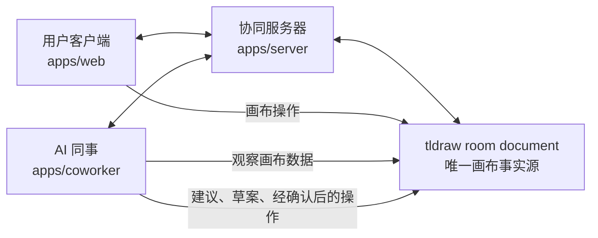
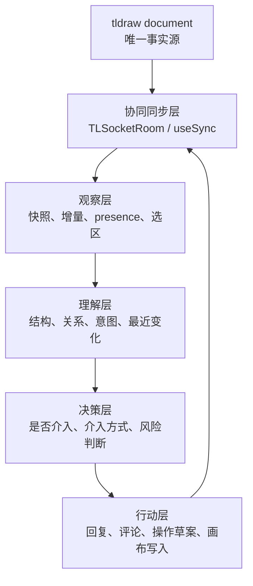
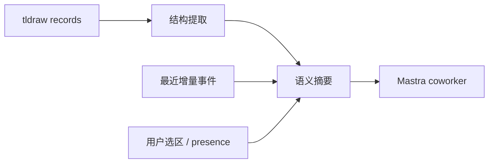
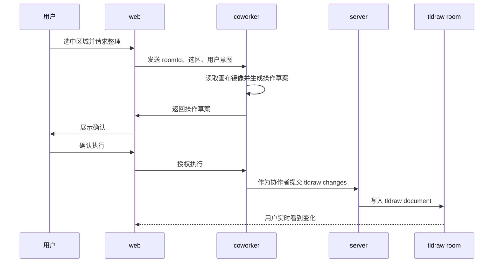
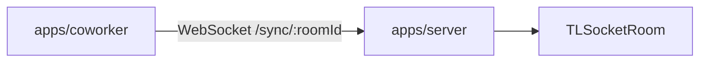
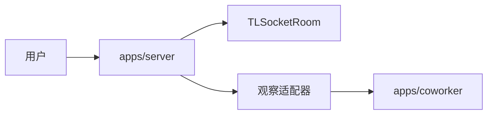
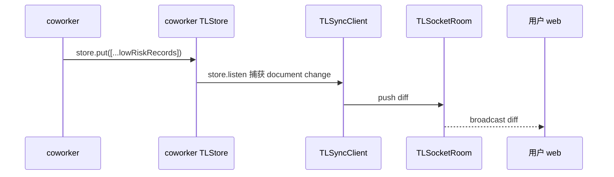
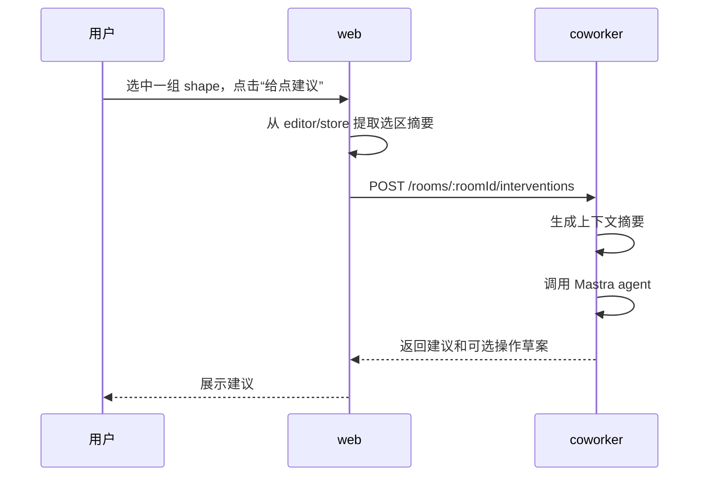
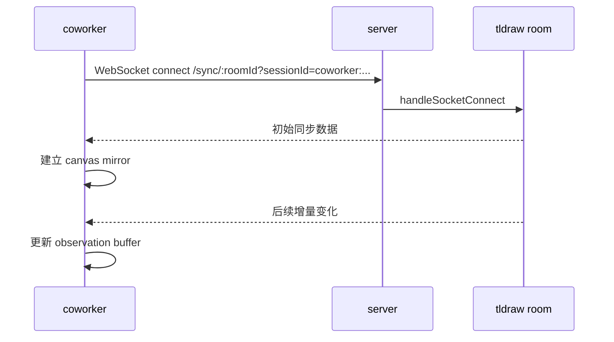
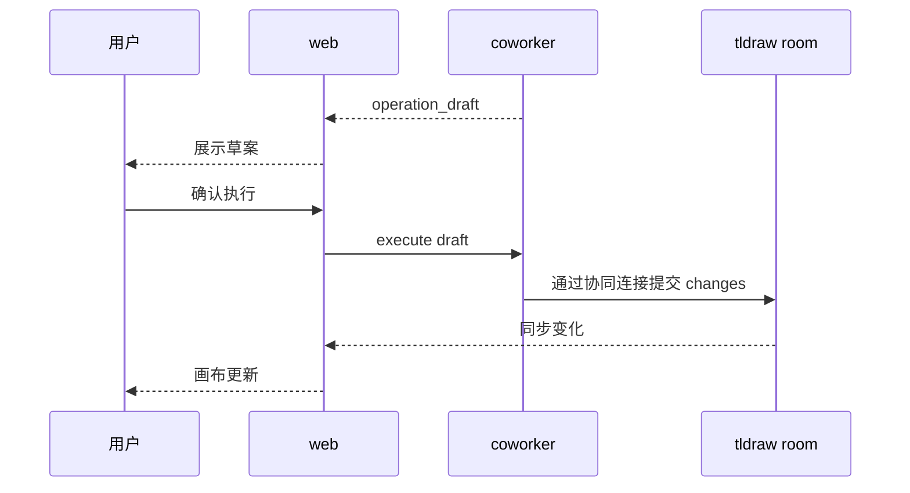

# Coworker 协同画布接入技术方案

## 1. 背景

drawless 当前已经有一个清晰的协同基础：

- `apps/web` 负责 Next.js 路由、tldraw 挂载、浏览器身份和协同客户端。
- `apps/server` 负责健康检查、就绪检查、WebSocket sync 和房间注册表。
- `packages/shared` 负责跨端类型、schema 和未来 AI 扩展点。
- `apps/coworker` 是新建的 Mastra 项目，当前已经定义了 `Drawless Coworker` agent，但尚未接入真实协同房间。

这个方案的目标不是给 tldraw 增加一个普通 AI 聊天框，而是把 coworker 设计成“进入同一个协同 room 的 AI 同事”。

用户和 coworker 的关系应该是：

- 用户在浏览器中进入某个 tldraw room。
- coworker 以一个特殊协作者身份进入同一个 room。
- coworker 通过画布数据理解项目上下文。
- coworker 可以给建议、提供灵感、提出操作草案。
- 在满足权限和确认条件后，coworker 可以通过协同边界提交画布修改。

核心原则：**tldraw document 始终是唯一画布事实源**。

## 2. 结论摘要

这个 idea 很适合 drawless，但落地时要避免两个误区。

第一个误区是把 coworker 做成 server 内部的“全知监听器”。server 的职责应该保持简单：维护 tldraw sync room 生命周期，接受 WebSocket 连接，把协同协议交给 tldraw sync core。server 不应该长期承担“理解用户意图”“分析画布结构”“决定是否介入”等 AI 语义职责。

第二个误区是让 coworker 直接解析原始 WebSocket 包。WebSocket 是传输层，tldraw sync 是协同协议层，二者都不等于业务语义。coworker 需要的是稳定的画布观察数据和语义摘要，而不是把底层同步包直接塞给模型。

推荐方向：

1. coworker 作为独立协作者连接同一个 room。
2. coworker 维护一份从 tldraw document 派生的只读画布镜像。
3. coworker 的理解层把 tldraw records 转换为语义摘要。
4. coworker 的决策层判断何时介入、说什么、是否提出画布操作。
5. coworker 的行动层只通过协同边界写回 tldraw document。

## 3. 总体架构



这张图里，coworker 和用户是并列的协作者。它不是藏在 server 里面的逻辑，也不是 web 页面里的装饰组件。

更细一点可以拆成五层：



## 4. 职责边界

### 4.1 apps/web

web 继续只负责用户的画布体验：

- 解析 room 路由。
- 生成浏览器设备身份和标签页 session。
- 使用 `useSync` 连接后端 WebSocket room。
- 挂载 `<Tldraw />`。
- 后续可以展示 coworker 的在线状态、建议入口、确认弹层或评论，但不在当前阶段做 UI 优化。

web 不应该：

- 维护第二套画布结构事实源。
- 直接把 AI 的内部推理写进 tldraw document。
- 在没有 shared 契约前临时拼装 AI payload。

### 4.2 apps/server

server 继续是协同服务器：

- 校验 origin、roomId、sessionId。
- 创建和复用 `TLSocketRoom`。
- 把 WebSocket 连接交给 `TLSocketRoom.handleSocketConnect`。
- 提供 health/ready。
- 管理 room 生命周期。

server 可以在后续增加“coworker 接入控制”的轻量能力：

- 判断某个 room 是否启用 coworker。
- 给 coworker 签发或校验专用 session。
- 提供 room 级 coworker 状态查询。
- 在必要时把 room 生命周期事件通知 coworker service。

server 不应该：

- 直接把所有 WebSocket 包发给 LLM。
- 在 sync 路由里写大量 AI 判断逻辑。
- 绕过 tldraw sync core 修改 room storage。
- 成为画布语义事实源。

### 4.3 packages/shared

shared 是本方案最重要的契约层。后续新增跨端类型时，要放在这里，并且每个属性都写中文注释。

建议 shared 逐步承载：

- coworker 身份类型。
- room 级 coworker 配置。
- 画布观察事件 schema。
- 画布语义摘要 schema。
- coworker 介入草案 schema。
- coworker 画布操作请求 schema。
- coworker 操作结果 schema。

### 4.4 apps/coworker

coworker 是 AI 同事运行时：

- 连接指定 tldraw room。
- 维护只读画布镜像。
- 订阅画布变化、presence、选区等观察数据。
- 生成画布摘要和用户操作摘要。
- 调用 Mastra agent 做建议、灵感和行动判断。
- 输出自然语言建议或画布操作草案。
- 在明确允许后，通过协同边界提交画布操作。

coworker 不应该：

- 自己发明一套和 tldraw document 平级的画布模型。
- 把 LLM 生成结果直接当成画布事实。
- 在没有用户确认和权限策略时直接大规模改画布。

## 5. Coworker 的协作者身份

coworker 应该有自己的协作者身份，而不是复用某个用户 session。

建议身份结构：

```ts
export interface DrawlessCoworkerIdentity {
  /** coworker 所在的协同房间 ID。 */
  roomId: DrawlessRoomId;
  /** coworker 连接 tldraw sync room 时使用的会话 ID。 */
  sessionId: DrawlessSessionId;
  /** coworker 在协同 presence 中展示的名称。 */
  displayName: string;
  /** coworker 在协同 presence 中展示的颜色。 */
  color: string;
  /** coworker 当前运行实例 ID，用于排查多实例重复进入同一房间。 */
  instanceId: string;
}
```

sessionId 可以采用稳定前缀：

```text
coworker:<roomId>:<instanceId>
```

需要注意：

- 同一个 room 最好只有一个 active coworker。
- 如果未来允许多个 worker 分工，要给它们不同 role，而不是都叫 coworker。
- coworker 的 presence 应该能被用户识别，避免用户不知道画布里有 AI 参与者。

## 6. 画布观察模型

coworker 需要实时知道画布发生了什么，但不建议直接把原始同步消息传给 LLM。应该拆成三种观察数据。

### 6.1 快照

快照描述某一刻的 tldraw document 状态。

用途：

- coworker 初次进入 room 时建立上下文。
- 长时间运行后重建上下文。
- LLM 需要全局理解时生成画布摘要。

示例契约：

```ts
export interface DrawlessCanvasSnapshot {
  /** 当前快照所属房间 ID。 */
  roomId: DrawlessRoomId;
  /** 快照生成时间，使用 ISO 字符串。 */
  capturedAt: string;
  /** 当前 page ID；没有明确 page 时为 null。 */
  currentPageId: string | null;
  /** tldraw record 数量摘要，避免直接把大对象塞进模型。 */
  recordCounts: DrawlessCanvasRecordCounts;
  /** 从 tldraw records 派生出的文本内容摘要。 */
  textIndex: DrawlessCanvasTextItem[];
  /** 从 tldraw records 派生出的图形对象摘要。 */
  shapeIndex: DrawlessCanvasShapeItem[];
  /** 当前快照的序列号或版本标识，用于和增量事件对齐。 */
  version: string;
}
```

### 6.2 增量事件

增量事件描述用户最近做了什么。

用途：

- 判断用户是否在连续操作。
- 判断用户是否停顿。
- 判断是否出现可介入节点。
- 生成“最近变化摘要”。

示例契约：

```ts
export interface DrawlessCanvasObservationEvent {
  /** 事件所属房间 ID。 */
  roomId: DrawlessRoomId;
  /** 事件 ID，用于去重和追踪。 */
  eventId: string;
  /** 事件发生时间，使用 ISO 字符串。 */
  occurredAt: string;
  /** 触发事件的协作者 session ID。 */
  actorSessionId: DrawlessSessionId;
  /** 事件类型。 */
  kind: DrawlessCanvasObservationKind;
  /** 受影响的 tldraw record ID 列表。 */
  recordIds: string[];
  /** 供 coworker 快速理解的人类可读摘要。 */
  summary: string;
}
```

事件类型可以先保持粗粒度：

```ts
export type DrawlessCanvasObservationKind =
  | "shape_created"
  | "shape_updated"
  | "shape_deleted"
  | "selection_changed"
  | "presence_updated"
  | "page_changed"
  | "unknown_change";
```

### 6.3 presence 和选区

presence 比画布内容更能表达“用户正在关注哪里”。

建议 coworker 观察：

- 用户当前选中的 shapes。
- 用户 viewport 所在区域。
- 用户 cursor 或 pointer 位置。
- 用户是否正在编辑文本。
- 用户是否长时间停顿。

这些信息不一定都能从当前 tldraw sync 数据稳定拿到，后续需要结合 tldraw API 验证。原则上可以先做最小版本：只观察 selection 和最近 changed record。

## 7. 画布理解层

画布理解层是本方案的核心。它不等于 LLM prompt，而是把 tldraw document 转成适合 LLM 和规则系统理解的中间表示。



建议分三步做：

### 7.1 结构提取

从 records 中提取：

- 文本 shape：内容、位置、大小、样式。
- 几何 shape：类型、位置、大小。
- 连接关系：arrow、binding、线段连接。
- 分组或空间聚类：哪些 shape 视觉上在同一区域。
- 页面信息：当前 page、其他 page。

这一步应该是确定性代码，不依赖 LLM。

### 7.2 语义摘要

基于结构提取结果生成摘要：

- 当前画布有哪些主要区域。
- 每个区域包含什么主题。
- 哪些文本看起来是标题。
- 哪些内容可能是待办、问题、结论。
- 最近用户改了什么。
- 当前用户可能关注哪个区域。

第一版可以用规则和轻量文本拼接，不一定马上用 LLM。

### 7.3 上下文裁剪

画布会越来越大，不能每次把所有 records 都发给模型。

建议裁剪策略：

- 当前选区优先。
- 最近变更优先。
- viewport 内对象优先。
- 标题和连接节点优先。
- 长文本截断，并保留原始 recordId。

输出给 Mastra agent 的上下文应该类似：

```json
{
  "roomId": "alpha",
  "focus": {
    "selectionRecordIds": ["shape:a", "shape:b"],
    "recentlyChangedRecordIds": ["shape:b"]
  },
  "canvasSummary": "画布包含三个区域：目标、任务拆解、风险...",
  "recentEvents": [
    "用户新增了一个文本节点：如何让 coworker 理解画布？",
    "用户选中了任务拆解区域的三个节点"
  ]
}
```

## 8. Coworker 介入模型

coworker 不应该看到任何变化就立即说话。真正像同事的 AI，需要判断“何时介入”。

### 8.1 介入等级

建议定义三种介入等级：

```ts
export type DrawlessInterventionLevel =
  | "silent"
  | "suggest"
  | "propose_action";
```

- `silent`：只观察，不打扰。
- `suggest`：给一句建议、问题或灵感。
- `propose_action`：提出可确认的画布操作草案。

### 8.2 介入触发条件

第一版可以只支持显式触发：

- 用户在聊天或命令入口里问 coworker。
- 用户点击“让 coworker 看看”。
- 用户选中一块区域后请求建议。

第二版再考虑半自动触发：

- 用户停顿超过一定时间。
- 用户反复修改同一块区域。
- 用户新增了明显的问题文本。
- 用户把多个孤立节点放在一起但没有组织结构。

自动触发要非常克制，避免打扰。

### 8.3 介入结果

介入结果分四类：

```ts
export type DrawlessCoworkerInterventionKind =
  | "message"
  | "question"
  | "operation_draft"
  | "canvas_operation";
```

- `message`：普通建议。
- `question`：追问用户意图。
- `operation_draft`：操作草案，不执行。
- `canvas_operation`：真实画布操作，必须满足权限和确认条件。

## 9. 画布行动模型

真实画布操作要比自然语言建议更严格。



### 9.1 操作草案

操作草案是 coworker 计划做什么，但还没有改画布。

```ts
export interface DrawlessCanvasOperationDraft {
  /** 草案 ID，用于用户确认和后续执行追踪。 */
  draftId: string;
  /** 草案所属房间 ID。 */
  roomId: DrawlessRoomId;
  /** 草案创建时间，使用 ISO 字符串。 */
  createdAt: string;
  /** 这次操作想帮助用户完成的目标。 */
  intent: string;
  /** 操作影响的目标对象描述。 */
  targetDescription: string;
  /** 操作风险等级。 */
  riskLevel: "low" | "medium" | "high";
  /** 是否需要用户确认。 */
  requiresUserConfirmation: boolean;
  /** 计划执行的结构化操作列表。 */
  operations: DrawlessCanvasOperation[];
}
```

### 9.2 操作类型

第一版建议只开放低风险操作：

```ts
export type DrawlessCanvasOperation =
  | DrawlessCreateNoteOperation
  | DrawlessCreateTextShapeOperation
  | DrawlessCreateArrowOperation
  | DrawlessMoveShapeOperation
  | DrawlessUpdateTextOperation;
```

暂时不建议开放：

- 批量删除。
- 大规模重排。
- 改用户已有长文本。
- 修改未知类型 record。
- 跨 page 大规模操作。

### 9.3 执行原则

所有真实操作必须：

- 保留原始用户内容。
- 可追踪是 coworker 发起。
- 尽量小步提交。
- 能在 tldraw 历史里撤销。
- 失败时返回结构化错误。
- 不绕过 sync room。

## 10. Server 接入策略

server 有两种可能的接入方式。

### 10.1 方案 A：coworker 作为外部客户端连接 sync room



优点：

- 最符合“同事进入 room”的产品模型。
- server 边界清晰。
- coworker 的读写都经过 tldraw sync。
- 未来可以独立部署 coworker。

缺点：

- Node 侧需要可靠地接入 tldraw sync client 或实现适配。
- coworker 需要自己维护画布镜像。
- 对 tldraw sync API 的理解要求更高。

这是推荐主路线。

### 10.2 方案 B：server 提供 room observation adapter



优点：

- coworker 不必完全模拟 tldraw 客户端。
- server 可以提供更稳定的观察事件。

缺点：

- server 会逐渐承担更多 AI 接入职责。
- 需要非常克制，避免 server 变成语义层。
- 仍然不能把 observer 当作第二事实源。

这个方案可以作为辅助路线，但不建议作为一开始的主架构。

### 10.3 推荐组合

主路线采用方案 A：

- coworker 作为客户端进入 room。
- coworker 维护画布镜像。
- coworker 通过 sync 写回。

server 只补充最小控制能力：

- coworker enable/disable。
- coworker session 鉴权。
- room 中 coworker 运行状态。
- 必要的生命周期通知。

## 11. MVP 阶段规划

### Phase 0：文档和契约准备

目标：

- 明确 coworker 是协作者，不是 server 内部插件。
- 在 `packages/shared` 增加最小 coworker 类型草案。
- 暂不接入真实 AI 操作。

交付：

- 本技术方案。
- shared 类型：identity、observation、intervention draft。
- 对应 schema 和测试。

### Phase 1：显式触发的只读 coworker

目标：

- 用户显式请求 coworker 看当前 room。
- coworker 能接收一个由 web 或 server 提供的画布摘要。
- coworker 只回复建议，不操作画布。

可能实现：

- web 从 tldraw editor/store 读取当前选区和简化 records。
- web 调用 coworker API。
- coworker 返回 message 或 operation_draft。

这个阶段不要求 coworker 真正常驻 room，但契约要按常驻 room 设计。

### Phase 2：coworker 常驻观察 room

目标：

- coworker 能以 session 进入指定 room。
- coworker 能维护当前画布镜像。
- coworker 能感知快照和增量变化。
- coworker 默认静默，只记录最近变化摘要。

交付：

- coworker room connector。
- canvas mirror。
- observation event buffer。
- room lifecycle 管理。

### Phase 3：可确认的操作草案

目标：

- 用户请求 coworker 整理、补充、解释画布。
- coworker 生成结构化操作草案。
- web 展示草案并要求确认。
- 仍不自动执行高风险操作。

交付：

- operation draft schema。
- draft preview。
- confirmation flow。

### Phase 4：低风险画布写入

目标：

- coworker 经确认后创建新文本、注释、箭头等低风险内容。
- 操作通过 tldraw sync 写回 room。
- 用户实时看到改动。

交付：

- action executor。
- 操作结果事件。
- 错误处理。
- 最小审计日志。

### Phase 5：半自动介入

目标：

- coworker 能在低打扰策略下主动提出建议。
- 例如用户停顿、重复修改、选中区域后无动作。

交付：

- intervention policy。
- cooldown。
- 用户关闭/暂停 coworker 的控制。

## 12. 关键技术问题调研结论

本节基于当前项目使用的 `tldraw@5.0.1`、`@tldraw/sync@5.0.1`、`@tldraw/sync-core@5.0.1` 本地类型定义和官方文档整理。

### 12.1 Node 侧如何连接 tldraw sync room

结论：**可行，推荐用 `@tldraw/sync-core` 的 `TLSyncClient` 作为 coworker 的常驻连接基础。**

调研依据：

- 官方文档说明，`@tldraw/sync-core` 可以集成到任何支持 WebSocket 的 JavaScript server 环境中；当前 drawless server 已经使用这个方向。
- `@tldraw/sync` 的 `useSync` 是 React hook，适合 web 客户端，不适合直接给 `apps/coworker` 复用。
- `@tldraw/sync-core` 暴露了 `TLSyncClient`、`ClientWebSocketAdapter`、`TLPersistentClientSocket`、`TLPresenceMode` 等底层能力。
- `TLSyncClient` 官方说明是双向同步本地 `Store` 和远端 sync server 的 client engine；它支持 `store`、`socket`、`presence`、`onLoad`、`onAfterConnect`、`onSyncError`。
- `@tldraw/sync` 的 `useSync` 内部也是创建 `createTLStore`、`ClientWebSocketAdapter`、`TLSyncClient`，所以 coworker 可以在 Node 侧复刻这条链路，而不是使用 React hook。

推荐实现形态：

```ts
import { atom } from "@tldraw/state";
import {
  ClientWebSocketAdapter,
  TLSyncClient
} from "@tldraw/sync-core";
import {
  createTLSchema,
  createTLStore,
  type TLRecord,
  type TLStore
} from "tldraw";

const schema = createTLSchema();
const store = createTLStore({ schema, id: "coworker:<roomId>" });
const socket = new ClientWebSocketAdapter(() => {
  const url = new URL("ws://127.0.0.1:3001/sync/<roomId>");
  url.searchParams.set("sessionId", "coworker:<roomId>:<instanceId>");
  url.searchParams.set("storeId", "coworker:<roomId>");
  return url.toString();
});

const client = new TLSyncClient<TLRecord, TLStore>({
  store,
  socket,
  presence: atom("coworker presence", null),
  onLoad() {
    // 初始同步完成，可以建立画布镜像和摘要。
  },
  onSyncError(reason) {
    // 记录错误并关闭或重连。
  }
});
```

实现注意：

- `ClientWebSocketAdapter` 使用全局 `WebSocket`。Node 22 已有内置 WebSocket 能力，但仍要在本项目实际运行时验证；如果 runtime 不满足，则要提供一个实现 `TLPersistentClientSocket` 的 `ws` 适配器。
- `ClientWebSocketAdapter` 的源码注释明确提醒：使用者需要自己处理连接健康检查；`TLSyncClient` 内部也会定时 ping 并在长时间无服务端交互时 reset。
- coworker 连接 URL 必须和 web 一样走 `/sync/:roomId?sessionId=...`，不能连接一个旁路地址。
- coworker 的 `sessionId` 需要遵守 shared 中的 `sessionIdSchema`，例如 `coworker:<roomId>:<instanceId>`。

最终判断：

- **Phase 2 的常驻 room 方案可以做，不需要发明新同步协议。**
- **Phase 1 仍然值得先做，因为它能更快验证产品感觉和语义摘要，不阻塞在常驻连接细节上。**

### 12.2 如何从 tldraw records 生成稳定摘要

结论：**第一版应该从 `TLStore` 派生摘要，而不是从 WebSocket 消息派生摘要。**

调研依据：

- `TLSyncClient` 同步完成后，coworker 拥有本地 `TLStore`。
- `Store` 暴露 `listen`、`getStoreSnapshot`、`put`、`remove` 等能力。
- `store.listen` 可以监听 document scope 的变化；`useSync` 内部也依赖 `store.listen({ source: "user", scope: "document" })` 把本地用户变更推送到 server。
- 这意味着 coworker 可以把 `TLStore` 当作只读镜像，基于 snapshot 和 listen 事件做摘要。

推荐摘要来源：

- 初始全量：`store.getStoreSnapshot("document")` 或直接读取 store 中 document scope records。
- 增量变化：`store.listen` 的 `changes`。
- presence：查询 `instance_presence` records。
- 用户选区：优先使用 presence 中的 selection 信息；如果后续发现默认 presence 不够，再由 web 显式传选区摘要。

第一版摘要范围：

- text shape：提取文本、位置、大小、所属 page。
- geo shape：提取类型、位置、大小。
- arrow/binding：提取连接关系。
- page/document：提取当前 page 和 page 列表。
- presence：提取其他协作者、选区、cursor 或 viewport 中可用字段。

不建议第一版做：

- 精准视觉理解。
- 图片内容 OCR。
- iframe/bookmark 内容理解。
- 任意自定义 shape 深度解析。
- 直接把完整 records 塞进 LLM。

最终判断：

- **摘要层可以确定性实现，不依赖 LLM。**
- **LLM 输入应该是 `CanvasSummary + RecentEvents + FocusContext`，不是原始 `TLRecord[]`。**
- **当前选区很重要；如果 Node coworker 很难稳定拿到用户当前焦点，Phase 1 先让 web 显式发送选区摘要是更稳的。**

### 12.3 coworker 如何写回画布

结论：**低风险写回可行，推荐通过 coworker 自己的 `TLStore.put/remove` 触发 `TLSyncClient` 同步；不要直接改 server storage。**

调研依据：

- `TLSyncClient` 官方说明中，本地 `store.put(...)` 会被自动同步到远端 sync server。
- `TLSocketRoom` 也有 `updateStore`，但这是 server-side room API，更适合维护、迁移或管理用途；如果把 AI 操作放在 server 内部执行，会削弱“coworker 是同事”的协作模型。
- 通过 coworker 的本地 store 写入，操作路径和普通客户端一致：本地 store change -> `TLSyncClient` push -> server `TLSocketRoom` -> 其他客户端同步。

推荐执行路径：



限制条件：

- 第一版只允许新增内容，不做删除。
- 第一版只允许新增独立文本、注释区、低风险 arrow。
- 修改用户已有文本、大规模移动、删除、跨 page 批处理全部视为高风险，必须推迟。
- 每次执行前必须有 operation draft 和用户确认。
- 所有 coworker 创建的内容要通过 metadata 或命名约定标记来源，便于后续撤销和筛选。

仍需验证：

- Node 侧没有完整 `Editor` UI runtime 时，直接构造 default shape records 的最佳 helper 是什么。
- tldraw 对 shape record 的必要字段、index、parentId、pageId、props 默认值要走官方 record factory 或 editor/store helper，不能手写残缺 record。
- “撤销”如果希望进入用户本地 undo stack，可能需要 web 侧确认后由用户客户端执行；如果由 coworker 远端执行，用户仍会看到同步变化，但不一定自然进入用户本地 undo 语义。

最终判断：

- **coworker 作为客户端写回是主路线。**
- **server `room.updateStore` 只能作为维护工具或后门管理能力，不作为产品化 AI 操作路径。**
- **Phase 4 之前必须先完成操作草案、确认、低风险 operation schema。**

### 12.4 server 需要改多少

结论：**server 当前 sync 核心可以保持不动，只需要小幅增加 coworker session 的接入控制。**

当前 `apps/server` 已经具备：

- `/sync/:roomId` WebSocket 路由。
- `sessionId` 校验。
- `RoomRegistry` 复用同一个 `TLSocketRoom`。
- `TLSocketRoom.handleSocketConnect` 接入。

后续最小改动：

- shared 增加 coworker session 前缀约定。
- server 在 `attachTldrawSyncSocket` 中识别 `coworker:` session。
- 可选：server 对 coworker session 做 room 级 enable/disable 校验。
- 可选：ready payload 增加 coworker 状态，但不要塞语义数据。

不建议改动：

- 不在 server 中解析 WebSocket payload 给 LLM。
- 不在 server 中维护画布摘要。
- 不在 server 中执行 AI 的常规画布操作。

最终判断：

- **server 仍然是协同服务器。**
- **coworker 的观察、理解、决策和行动都应该主要在 `apps/coworker` 内完成。**

## 13. 数据流示例

### 13.1 用户请求建议



### 13.2 coworker 常驻观察



### 13.3 确认后执行画布操作



## 14. 安全和控制

### 14.1 权限

第一版可以简单处理：

- 只有本地开发环境启用 coworker。
- room 默认不自动启用 coworker。
- 用户显式触发后才启动或唤醒 coworker。

后续需要：

- room 级开关。
- 用户级权限。
- coworker session 鉴权。
- 操作确认策略。

### 14.2 隐私

coworker 会读取画布内容，因此要明确：

- 哪些数据会进入模型上下文。
- 是否包含用户身份。
- 是否包含完整画布文本。
- 是否记录长期 memory。

当前 Mastra agent 使用 `Memory`，后续要决定 memory 的范围：

- room 级 memory。
- 用户级 memory。
- session 级 memory。
- 是否允许清除。

### 14.3 风险等级

建议操作按风险分级：

- low：新增注释、新增独立文本、创建建议区。
- medium：移动 shape、新增连接、修改 coworker 自己创建的内容。
- high：删除内容、修改用户文本、大规模整理布局。

MVP 只做 low。

## 15. 推荐的目录演进

```text
packages/shared/src/
  coworker.ts
  canvas-observation.ts
  canvas-intervention.ts

apps/coworker/src/mastra/
  agents/drawless-coworker.ts
  tools/canvas-intervention-tool.ts
  runtime/room-connector.ts
  runtime/canvas-mirror.ts
  runtime/observation-buffer.ts
  runtime/action-executor.ts
  runtime/intervention-policy.ts

apps/server/src/
  coworker/coworker-config.ts
  coworker/coworker-session.ts

apps/web/src/
  lib/canvas-observation.ts
  lib/coworker-client.ts
```

这个结构只是方向，不代表要一次性创建所有文件。

## 16. 测试策略

### 16.1 shared

- schema 能验证合法 roomId/sessionId。
- observation event schema 能拒绝缺少必要字段的数据。
- operation draft schema 能表达低风险操作。
- 每个 shared 类型属性保留中文注释。

### 16.2 server

- 普通用户 sync 连接不受 coworker 影响。
- coworker session 可以通过校验。
- 禁用 coworker 时拒绝 coworker 进入 room。
- room registry 生命周期仍然清晰。

### 16.3 coworker

- 没有画布上下文时不编造内容。
- 接收到快照后能生成摘要。
- 接收到最近事件后能更新 observation buffer。
- 操作草案默认需要用户确认。
- 没有执行权限时不会写画布。

### 16.4 web

- 选区摘要生成稳定。
- coworker 返回 message 时能展示。
- coworker 返回 operation draft 时能等待确认。
- 取消确认不会改动画布。

## 17. 已判定事项和开放问题

### 17.1 已判定事项

1. Node 侧常驻连接使用 `@tldraw/sync-core` 的 `TLSyncClient`，不使用 React hook `useSync`。
2. coworker 作为客户端进入同一个 sync room，不作为 server 内部监听器。
3. server 不解析原始 WebSocket 包给 LLM。
4. 画布摘要从 `TLStore` snapshot 和 `store.listen` 的 changes 派生。
5. coworker 写回画布时通过自己的 `TLStore.put/remove` 触发 sync，不直接改 server storage。
6. MVP 先做显式触发的只读建议，再做常驻观察。

### 17.2 仍需产品决策

1. coworker 是否默认进入每个 room，还是用户显式唤醒后才进入？
2. coworker 的 presence 应该如何在 tldraw UI 中展示？
3. 操作草案确认 UI 放在哪里，如何不破坏当前“逻辑验证壳层”的 UI 约束？
4. coworker memory 是 room 级、用户级还是 session 级？
5. 如果多个用户同时在 room 中，coworker 应该响应谁的意图？
6. coworker 创建的内容如何标记来源，以便用户筛选、撤销或隐藏？
7. 哪些低风险操作可以第一批开放给 coworker 执行？

## 18. 推荐下一步

建议下一步不要直接做完整自动操作，而是先做 Phase 0 和 Phase 1，同时用一个小 PoC 验证 Phase 2 的 `TLSyncClient` 常驻连接。

具体顺序：

1. 在 `packages/shared` 增加 coworker identity、observation、intervention draft 的类型和 Zod schema。
2. 在 `apps/web` 增加一个只读的当前选区摘要函数，不改 UI。
3. 在 `apps/coworker` 增加一个 HTTP 或 Mastra tool 入口，接收 roomId、用户意图、选区摘要。
4. 让 coworker 返回建议和操作草案，但不执行画布修改。
5. 在 `apps/coworker` 做一个独立 PoC：用 `ClientWebSocketAdapter + TLSyncClient + createTLStore` 连接本地 `/sync/:roomId`，同步完成后输出 snapshot 摘要。
6. PoC 通过后，再把常驻 room connector 纳入 Phase 2。

这样能快速验证产品感觉，同时不会破坏当前最重要的协同链路。
